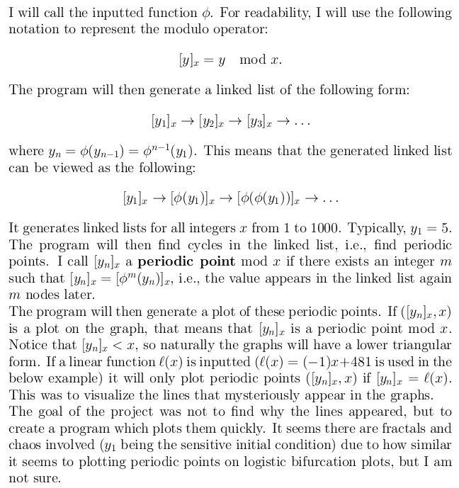
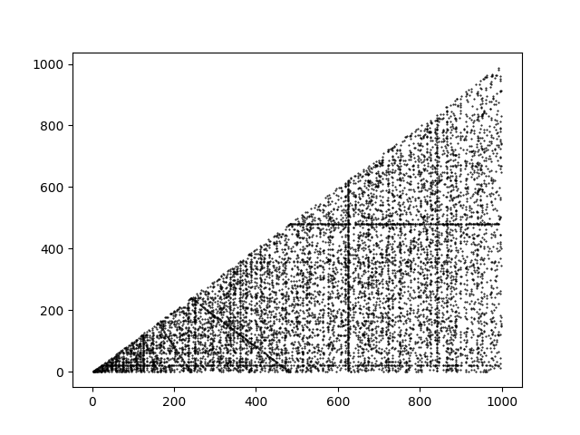
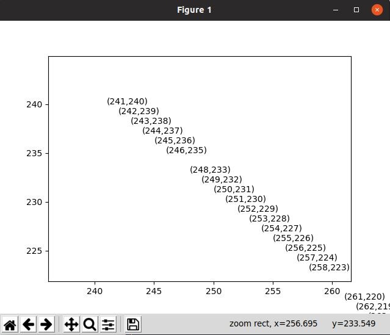

# UGR-150-303
<h1>Visualizing Dynamical Systems of Polynomials Modulo <i>n</i> Using Matplotlib</h1>
<h2>Undergraduate Research Project with Jonathan Weisbrod</h2>

Upon running periodicList.py with Python3, you will be presented with:

<h2>Plot of x²-3</h2>

You may run the program with a given line where it will only plot the coordinate values along that line. Here I zoomed in on the plot given with 'x^2-3' as the function and '-1*x+481' as the line.

